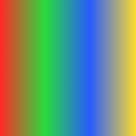
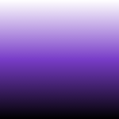
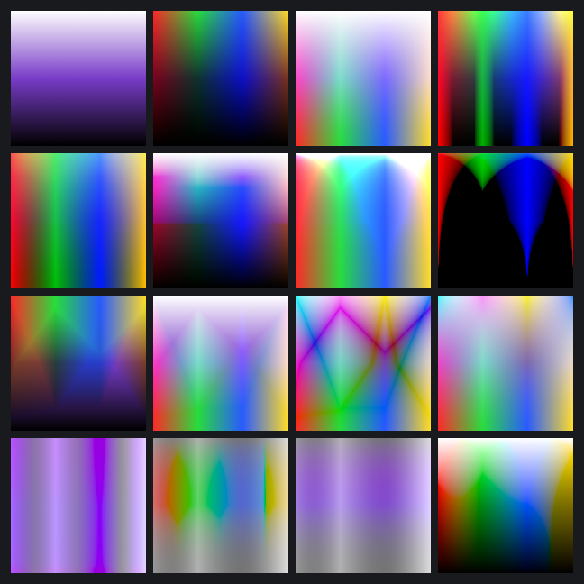
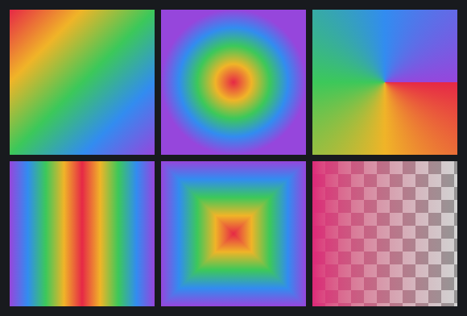
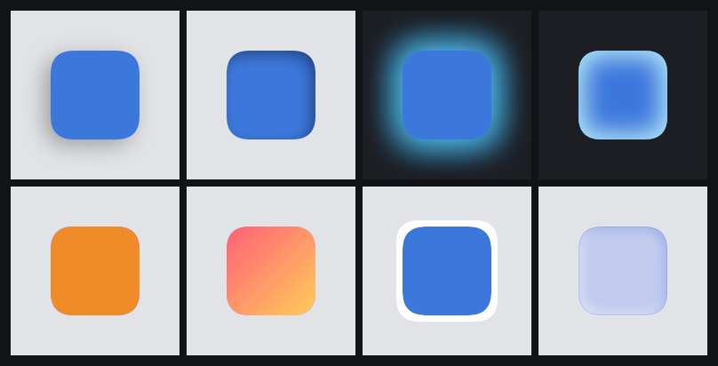

# Examples

Five standalone programs, each rendering a PNG into `examples/out/`. Run one with:

```
go run ./examples/blendmodes
go run ./examples/gradients
go run ./examples/effects
go run ./examples/paths
go run ./examples/showcase
```

Or render them all:

```
for d in blendmodes gradients effects paths showcase; do go run ./examples/$d; done
```

`internal/demo` holds the shared helpers (PNG saving, solid and checker fills,
and the rounded-rect, star, and pentagram path builders).

---

## Showcase

[`showcase/main.go`](showcase/main.go) → [`out/showcase.png`](out/showcase.png)


A single poster that combines most of the library at once. Layers, bottom to top:

1. **Background** a diagonal linear gradient from deep blue to magenta.
2. **Glow blobs** three soft circles composited with the **Screen** blend mode at
   half opacity, for ambient colored light.
3. **Badge** a disc masked from a solid fill, carrying a **drop shadow**, a
   **gradient overlay** (orange to pink), a **bevel**, and a white **outer
   stroke**.
4. **Emblem** a gold star masked from a solid fill, with an **outer glow**, a
   **drop shadow**, and a **bevel**.
5. **Panel** a rounded card with a **drop shadow**, a **gradient overlay**, an
   **inner shadow**, and a thin inside **stroke**.

It also exercises vector masks, a pass-through root group, and the fixed
effect-stacking order.

---

## Blend modes

[`blendmodes/main.go`](blendmodes/main.go) → [`out/blendmodes.png`](out/blendmodes.png)

Every cell blends the same two inputs. The **backdrop** is a horizontal rainbow
and the **overlay** is a vertical ramp (white to purple to black):

| Backdrop | Overlay |
|----------|---------|
|  |  |

Each cell composites the overlay over the backdrop with one blend mode:



The formulas come from ISO 32000-2 (the PDF spec) section 11.3.5. Cells are in
`blend.Mode` iota order, left to right, top to bottom:

| Position | Mode | Category | What it does |
|----------|------|----------|--------------|
| Row 1, col 1 | **Normal** | — | Source replaces the backdrop, weighted by alpha. No color interaction |
| Row 1, col 2 | **Multiply** | Darkening | Multiplies channels. Always darkens, white is neutral. Like stacked transparencies |
| Row 1, col 3 | **Screen** | Lightening | Inverse-multiply. Always lightens, black is neutral. Like projected light |
| Row 1, col 4 | **Overlay** | Contrast | Multiplies the dark areas and screens the light ones, keyed on the backdrop. Boosts contrast |
| Row 2, col 1 | **Soft Light** | Contrast | A gentle dodge or burn depending on the source, like a diffuse spotlight |
| Row 2, col 2 | **Hard Light** | Contrast | Overlay with the operands swapped, keyed on the source. Harsh contrast |
| Row 2, col 3 | **Color Dodge** | Lightening | Brightens the backdrop to reflect the source. Produces blown-out highlights |
| Row 2, col 4 | **Color Burn** | Darkening | Darkens the backdrop to reflect the source. Produces crushed shadows |
| Row 3, col 1 | **Darken** | Darkening | Keeps the darker of backdrop and source, per channel |
| Row 3, col 2 | **Lighten** | Lightening | Keeps the lighter of backdrop and source, per channel |
| Row 3, col 3 | **Difference** | Comparative | Absolute difference of the two. Identical colors cancel to black |
| Row 3, col 4 | **Exclusion** | Comparative | Like Difference but lower contrast, mid-grays stay gray |
| Row 4, col 1 | **Hue** | Non-separable | Source hue with the backdrop's saturation and luminance |
| Row 4, col 2 | **Saturation** | Non-separable | Source saturation with the backdrop's hue and luminance |
| Row 4, col 3 | **Color** | Non-separable | Source hue and saturation with the backdrop's luminance. Classic tinting |
| Row 4, col 4 | **Luminosity** | Non-separable | Source luminance with the backdrop's hue and saturation |

The four non-separable modes (Row 4) act on the whole RGB triple at once rather
than channel by channel, using the Lum/Sat/SetLum/SetSat helpers from the spec.

---

## Gradients

[`gradients/main.go`](gradients/main.go) → [`out/gradients.png`](out/gradients.png)



The five gradient geometries plus a transparency demo. Every gradient is
multi-stop with an independent color and opacity per stop, interpolated in sRGB
to match Photoshop and converted to linear light for compositing. Cells left to
right, top to bottom:

| Position | Type | What it does |
|----------|------|--------------|
| Row 1, col 1 | **Linear** | Color runs along the axis from P0 to P1 |
| Row 1, col 2 | **Radial** | Concentric rings from a center, the radius set by \|P1-P0\| |
| Row 1, col 3 | **Angle** (conic) | Sweeps the stops around the center by angle |
| Row 2, col 1 | **Reflected** | A linear gradient mirrored about its start point |
| Row 2, col 2 | **Diamond** | Square contours rotated to the axis, a Chebyshev-distance field |
| Row 2, col 3 | **Opacity fade** | One color fading from opaque to transparent, shown over a checkerboard so the transparency is visible |

Each type also supports a spread mode (Pad, Repeat, Reflect) for what happens
outside the `[0,1]` parameter range, not shown here (all use Pad).

---

## Effects

[`effects/main.go`](effects/main.go) → [`out/effects.png`](out/effects.png)



The eight non-destructive layer styles, each applied to a rounded-rectangle
badge. Glow cells use a dark backdrop so the glow reads. Cells left to right,
top to bottom:

| Position | Effect | What it does |
|----------|--------|--------------|
| Row 1, col 1 | **Drop Shadow** | An offset, blurred copy of the layer's alpha behind it. Multiply by default |
| Row 1, col 2 | **Inner Shadow** | Darkness inside the top edges, as if the shape were recessed. Multiply |
| Row 1, col 3 | **Outer Glow** | Color radiating outward from the edge, behind the layer. Screen by default |
| Row 1, col 4 | **Inner Glow** | Color radiating inward from the edge, clipped to the shape. Screen |
| Row 2, col 1 | **Color Overlay** | A flat color filling the shape |
| Row 2, col 2 | **Gradient Overlay** | A gradient field clipped to the shape |
| Row 2, col 3 | **Stroke** | An outline band along the alpha edge, aligned inside, outside, or centered (outside here) |
| Row 2, col 4 | **Bevel & Emboss** | A lit 3D relief derived from the alpha height field, split into a highlight (Screen) and a shadow (Multiply) |

Shadows and outer glow render behind the layer, everything else renders in front.
Effects are always composited in Photoshop's fixed stacking order regardless of
the order you list them, so the same set always produces the same result. Bevel &
emboss is close-and-configurable rather than pixel-exact, by design (it is the
one effect with no clean public spec).

---

## Paths

[`paths/main.go`](paths/main.go) → [`out/paths.png`](out/paths.png)


Fill and stroke features drawn straight onto one buffer, top to bottom:

- **Stroke caps** (row 1) how open ends are terminated: **Butt** (flush with the
  endpoint), **Round** (a semicircle past the end), **Square** (a flat extension
  of half the stroke width).
- **Stroke joins** (row 2) how corners connect: **Miter** (extended to a sharp
  point, subject to a miter limit), **Round** (an arc), **Bevel** (a flat
  chamfer).
- **Dashes** (row 3) an on/off dash pattern, here with round caps on each dash.
- **Fill rules** (row 4, left and center) the same self-intersecting pentagram
  filled two ways: **NonZero** (winding number, solid center) and **EvenOdd**
  (crossing parity, hollow center pentagon).
- **Bezier** (row 4, right) chained cubic curves stroked with a round cap and
  join.

Stroking is the piece missing from the standard library's vector rasterizer, so
this is the part of `path` with no off-the-shelf Go equivalent.
